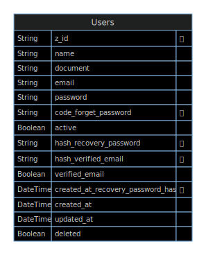

# Microservices API User

>  API using Node.js + TypeScript + gRPC

## Required global dependencies

- Node.js v18
- Npm
- Docker

## Up & Running

1. Install local dependencies:

```terminal
npm install
```

2. Start the server and generete docs api:

```terminal
npm run dev
```

3. Tests (watch mode):

```terminal
npm run test:watch
```

4. Tests Integretion:

```terminal
npm run test:integretion
```

5. Start docker from DB mongo:

```
npm run docker:up
```

6. Stop docker after get server down:

```
npm run docker:down
```

7. Destroy all data from DB:

```
npm run docker:destroy
```

## Scripts

| Script                           | Description                                                   |
| -------------------------------- | ------------------------------------------------------------- |
| `npm run start`                  | Run production server                                         |
| `npm run dev`                    | Get database up and run dev server                            |
| `npm run docker:up`              | Get docker configuration up                                   |
| `npm run docker:down`            | Get docker configuration down                                 |
| `npm run docker:destroy`         | Destroy database and all docker data                          |
| `npm run test`                   | Run unit and integration tests once (great to be used in CI)  |
| `npm run test:unit`              | Run unit tests once                                           |
| `npm run test:watch`             | Run unit tests in watch mode                                  |
| `npm run test:integration`       | Run integration tests once                                    |
| `npm run test:integration:watch` | Run integration tests in watch mode                           |
| `npm run lint:fix`               | Fix lint errors                                               |
| `npm run type-check`             | TS typechecking                                               |
| `npm run prepare`                | Not suposed to be manually used. It's just to configure husky |
| `npm run build`                  | Generates production build                                    |
| `npm run prisma:studio`          | Interact with your Data with full CRUD functionality          |
| `npm run prisma:generate`        | Generate Prisma Client                                        |
| `npm run prisma:format`          | Formate code in schema.prisma                                 |

## Tree structure

This project uses Hexagonal Architecture (Ports & Adapters).

```terminal
.
├── src
│   ├── config
│   │   └── module-alias.ts
│   ├── core
│   │   ├── <domain / entity>
│   │   │   ├── use-cases
│   │   │   │   ├── <use-case>-adapter.ts
│   │   │   │   ├── <use-case>.test.ts
│   │   │   │   ├── <use-case>.ts
│   │   │   └── types.ts
│   │   └── types
│   │       └── <type>.ts
│   ├── ports
│   │   ├── adapters
│   │   │   └── <port-adapter>
│   │   └── <port>
│   ├── app.ts
│   └── index.ts
├── .env.example
├── jest.config.integration.js
└── jest.config.js
```

| Directory / File                     | Description                                                                                                                                                         |
| ------------------------------------ | ------------------------------------------------------------------------------------------------------------------------------------------------------------------- |
| `src`                                | All source code write in TypeScript must be in this directory.                                                                                                      |
| `src/index.ts`                       | Main entry point for initial configuration of the project. **Do not edit this file.** Start with `src/app.ts`.                                                      |
| `src/app.ts`                         | Project entry point. You can call your first `port` here and boot your providers that should start before your server.                                              |
| `src/config`                         | All configurations can live here.                                                                                                                                   |
| `src/core`                           | Pure domain implementations. `core` files must **not know** any `port` or `adapter`, nor anything ouside `core` directory.                                          |
| `src/core/<domain/entity>`           | Inside the `core` directory, you can organize your files by domain or entity.                                                                                       |
| `src/core/<domain/entity>/types`     | Start point for modelling your domain / entity with TypeScript types.                                                                                               |
| `src/core/<domain/entity>/use-cases` | Here you can put your functions with business rules for this specific domain / entity, and the adapters that `ports` will use.                                      |
| `src/core/types`                     | Here you can put the types that are not related with any of your domains or entities.                                                                               |
| `src/helpers`                        | Here you can put your global helpers.                                                                                                                               |
| `src/ports`                          | Anything with external world contact. When you need to access something on `core`, you must use an `adapter`.                                                       |
| `src/ports/adapters`                 | Adapters for ports. For example: You can have a `database` adapter that can use `Postgres` or `MongoDB`. An `http` adapter that can consume `express` or `fastify`. |
| `src/ports/<port>`                   | Here you can create your raw `ports` with real implementation: `express` / `fastify` as http server, `postgres` / `mongodb` as databases, etc.                      |
| `.env.example`                       | List of Environment Variables. Please, copy this file and create a new `.env` file to use Env Vars.                                                                 |
| `jest.config.integration.js`         | Jest configuration file for integration tests.                                                                                                                      |
| `jest.config.js`                     | Main Jest configuration file.                                                                                                                                       |

### Environment Variables

You can use env vars by copying the `.env.developer` file to a new `.env` file on the root of the project.
To document all used env vars, and get autocomplete when use the function `env('YOU_VAR')`.

### Global import

All files and dirs inside `src` directory can be imported using `@/`.
Prefer using this way over local import (`../../`).

## Link to docs api

```
http://localhost:{process.env.port}/api-docs/{process.env.API_KEY_DOCS}/
```

## Import docs to insomnia

```
http://localhost:{process.env.port}/api-docs/{process.env.API_KEY_DOCS}/josn
```

## Sentry
To use Sentry, simply add the `SENTRY_DSN` provided upon registering on their website: [https://sentry.io/auth/login/](https://sentry.io/auth/login/).

## Nodemailer to send mail

To configure Node Nodemailer credentials, simply visit [https://ethereal.email/](https://ethereal.email/) and click the *Create Ethereal Account* button. Afterwards, copy the credentials from the Username and Password fields and add them to your .env file as follows:
```env
AUTH_USER_EMAIL: Username
AUTH_PASS_EMAIL: Password

```
Finally, click the *Open Mailbox* button.


## Model ERD


